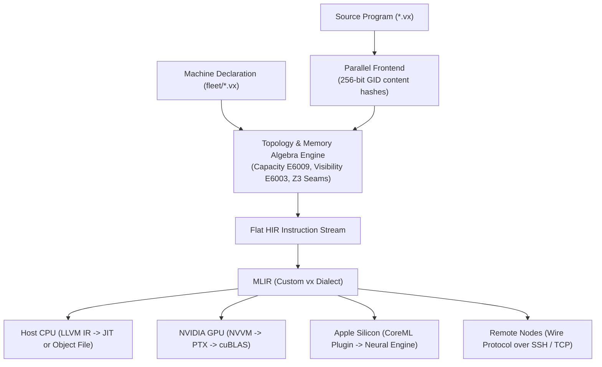

<div align="center">
  <h1>Vx</h1>
  <p><b>One language, every core.</b></p>
  <p>A heterogeneous-systems programming language that puts hardware topology, memory placement, and reachability directly in the type system.</p>

<p>
    <a href="https://github.com/vx-lang/Vx/actions"></a>
    <a href="LICENSE"></a>
    
    
    
    
  </p>

<p>
    <a href="#why-vx">Why Vx</a> •
    <a href="#the-30-second-demo">30-Second Demo</a> •
    <a href="#quickstart">Quickstart</a> •
    <a href="#four-core-pillars">Core Pillars</a> •
    <a href="#how-it-compiles">Architecture</a> •
    <a href="#current-status--known-limitations">Status & Limitations</a> •
    <a href="docs/tutorial.md">Tutorial</a>
  </p>
</div>

______________________________________________________________________

## Why Vx?

Modern high-performance programs are rarely confined to a single CPU. They orchestrate work across host DRAM, PCIe buses, GPU high-bandwidth memory (HBM), and specialized accelerators like NPUs or the Apple Neural Engine (ANE).

In conventional languages (CUDA, C++, Python), **hardware topology and memory spaces are invisible to the compiler**. If host code reads a device pointer, or if an asynchronous transfer is not awaited, your program fails at runtime: with a silent corruption, a fatal segmentation fault, or an out-of-memory (OOM) crash hours into a distributed training job.

**Vx eliminates this class of bugs at compile time.**

Where a value lives (`Memory::CPU_DRAM`, `Memory::GPU_HBM`, `Memory::NPU_HBM`) and where code executes (`Topology::GPU[0]`, `Topology::NPU[0]`, `Topology::ANE`) are first-class types. The compiler checks memory capacity, bus bandwidth, and address visibility *before* code ever touches silicon:

| Challenge | Today (CUDA / C++ / PyTorch) | The Vx Way |
| :--- | :--- | :--- |
| **Invalid device memory access** | Host reads GPU pointer $\\rightarrow$ runtime segfault (`cudaErrorIllegalAddress`) | **Compile Error `E6003`**: Compiler proves host cannot address device space and suggests the missing transfer |
| **Memory capacity exhaustion** | Runtime OOM crash when a tensor working set exceeds VRAM | **Compile Error `E6009` / `E6010`**: Compiler checks memory capacity ahead of time against declared hardware limits |
| **Targeting multi-accelerator nodes** | Fragmented across CUDA, Metal, OpenCL, and proprietary vendor runtimes | **Unified syntax**: `spawn on(Topology::...)` with declarative hardware definitions in `fleet/` |
| **Asynchronous data hazards** | Race conditions and manual stream synchronization bugs | **Formally verified seam contracts**: Transfer bounds and visibility are proven by a Z3 solver |

______________________________________________________________________

## The 30-Second Demo

Here is a complete matrix multiplication that prepares data on the host, stages it into an accelerator's HBM, executes on the device, and brings the result back:

```rust
fn main() -> i32 {
  // 1. Allocate and initialize host matrices
  let a = Tensor<f32, [4, 4]>::fill(2.0);
  let b = Tensor<f32, [4, 4]>::fill(3.0);
  let mut c = Tensor<f32, [4, 4], Memory::NPU_HBM>::uninit();

  // 2. Explicitly stage data across the interconnect into accelerator HBM
  let a_npu = transfer(a, Memory::NPU_HBM);
  let b_npu = transfer(b, Memory::NPU_HBM);

  // 3. Dispatch execution onto the declared topology
  spawn on(Topology::NPU[0]) {
    c = a_npu @ b_npu;
  }

  // 4. Retrieve result back to host DRAM
  let c_host = transfer(c, Memory::CPU_DRAM);
  print(c_host[0][0]); // 24
  return 0;
}
```

Run it with the built-in JIT:

```bash
$ vxc matmul.vx
24
```

### What happens when you make a mistake?

If you forget to transfer the input `a` and attempt to read it inside the `spawn on(Topology::NPU[0])` block, the compiler refuses the program immediately:

```text
Error[E6003] at matmul.vx:12:9: 'a' lives in CPU_DRAM but NPU[0] sees only [NPU_HBM];
insert an explicit transfer to NPU_HBM (cost 50 on the declared path)
```

The compiler proves that `NPU[0]` cannot address `CPU_DRAM`, finds the cheapest legal route across the declared bus edges, calculates the transfer cost, and provides the fix.

______________________________________________________________________

## Quickstart

### Prerequisites

- **macOS**: `brew install llvm z3 cmake`
- **Linux (Ubuntu/Debian)**: Install LLVM 22 from [apt.llvm.org](https://apt.llvm.org), then `apt install z3 lld cmake`
- **Rust**: Stable toolchain (Rust 2021)

### 1. Build the Compiler

```bash
# Clone the repository
git clone https://github.com/vx-lang/Vx.git
cd Vx

# Locate LLVM and write local configuration
./setup.sh

# Source environment variables (required before running cargo)
source config.local

# Build the release compiler
cargo build --release
```

### 2. Run Programs

```bash
# Run a smoke test with the JIT compiler (default action)
./target/release/vxc examples/docker_smoke.vx

# Compile and check against a declared NVIDIA H100 machine (works on any host!)
./target/release/vxc --host default --machine fleet/h100-sxm.vx examples/docker_smoke.vx -o smoke_h100

# Inspect capacity admission and routing costs as JSON
./target/release/vxc --host default --machine fleet/h100-sxm.vx examples/docker_smoke.vx --diagnostics-json out.json

# Inspect the generated MLIR
./target/release/vxc examples/docker_smoke.vx --action emit-mlir
```

### 3. Run the Test Suite

```bash
source config.local
cargo test
```

Over 530 unit tests and 40 integration suites verify placement rules, differential CUDA checks, and determinism.

______________________________________________________________________

## Four Core Pillars

### 1. Placement and Capacity in the Type System

A tensor's type in Vx carries its element type, dimensions, and its residency domain: `Tensor<f32, [4, 4], Memory::GPU_HBM>`.

The compiler enforces strict invariants before codegen:

| Check | Diagnostic | Rules Out |
| :--- | :--- | :--- |
| **Address-space visibility** | `E6003` | Host code reading device memory, or an accelerator accessing inaccessible address spaces |
| **Capacity admission** | `E6009`, `E6010` | Single tensors or multi-tensor working sets that exceed available memory |
| **Transfer reachability** | `E6002` | Copying between memory domains with no declared hardware edge |
| **Optimal transfer routing** | Cost Model | Sub-optimal routes; automatically prices containment hops across memory hierarchies |
| **Seam contracts** | Prover (`z3`) | Reading an asynchronous transfer buffer before it has been synchronized |
| **Linear buffers** | Borrow Checker | Use-after-move of consumed device memory buffers |

A differential test suite pairs each check against CUDA on an NVIDIA A100: errors that CUDA detects as runtime aborts, failed `cudaMalloc` allocations, or segfaults are caught by Vx at compile time.

### 2. Declarative Hardware Topologies (`fleet/`)

Instead of hardcoding memory sizes and bus links, machines are declared as clean specification files:

```rust
Memory HBM  { capacity: 80 GiB, bandwidth: 3.35 TB/s, managed: explicit, scope: device }
Memory L2   { within: Memory::HBM, capacity: 50 MiB, bandwidth: 12 TB/s, managed: cached }
Memory SMEM { within: Memory::L2, capacity: 228 KiB, bandwidth: 128 B/cyc,
              clock: 1.98 GHz, replicas: 132, granule: 1 KiB, scope: sm }

Topology Device {
    arch: nvptx64,
    memory: Memory::HBM,
    transfer Memory::CPU_DRAM -> Memory::HBM : 63 GB/s,
}
```

The [`fleet/`](fleet/) directory includes 12 validated specifications:

- **Accelerators**: NVIDIA A100 (40GB & 80GB), H100 SXM, H200, B200, AMD Instinct MI300X, Apple M4 UMA, ARM Cortex-M7.
- **Nodes & Systems**: 2-GPU and 8-GPU interconnected systems, Intel Xeon compute targets, and x86 host profiles.

Because `vxc` cross-compiles against declared machines (`--machine fleet/<sku>.vx`), you can verify and compile binaries for an 8-GPU H100 cluster directly from an M4 MacBook Air without renting cloud GPUs.

### 3. Zero-Lock Parallel Compiler Frontend

Traditional compiler frontends frequently bottleneck on single-threaded symbol resolution or lock contention (`Mutex`/`RwLock`). Vx introduces an 8-phase parallel architecture:

- **256-bit Global Identifiers (GIDs)**: Every symbol, nominal type, and monomorphized instantiation is a flat `[u64; 4]` content hash. Symbol lookup involves zero pointer chasing or string hashing.
- **Lock-Free Phases**: Rayon worker threads parse and type-check modules in complete isolation. An immutable frozen epoch (`GlobalSession`) guarantees that worker threads never contend.
- **SIMD Type Patching**: Vectorized sweeps patch local deferred type parameters to absolute global indices in microseconds.
- **Deterministic Output**: Generated MLIR is byte-identical whether compiled on 1 thread, 16 threads, or with multi-threading disabled.

For a deep dive into the design, see the [Parallel Compiler Architecture](docs/architecture_executive_summary.md).

### 4. Native ML Primitives & Automatic Differentiation

Vx includes native tensor abstractions with rank and extent tracking, dynamic dimensions (`Tensor<f32, [?, ?]>`), matrix multiplication (`@`), and built-in automatic differentiation (`grad`, `vjp`, `jvp`) lowering through an optional Enzyme MLIR plugin:

```rust
fn loss(x: f32) -> f32 {
    return x * x;
}

fn main() -> i32 {
    let dx: f32 = grad(loss, 3.0); // 6.0
    print(dx);
    return 0;
}
```

For a full real-world demonstration, explore [`examples/llama.vx`](examples/llama.vx), which implements a complete, clean Llama 2 forward pass with tensor abstractions.

______________________________________________________________________

## How it Compiles



### Supported Execution Backends

| Target | Lowering Pipeline | Tested & Verified Workloads |
| :--- | :--- | :--- |
| **CPU (x86_64, ARM64)** | MLIR $\\rightarrow$ LLVM IR $\\rightarrow$ Native (JIT or `.o`) | Full test suite and standard library |
| **NVIDIA GPU** | MLIR $\\rightarrow$ NVVM $\\rightarrow$ PTX payload via CUDA driver | Disaggregated prefill/decode split, cuBLAS GEMMs on A100 & H100 |
| **Apple Silicon (ANE)** | CoreML dispatch from native plugin | FP16 512×512 matmul on Neural Engine, FP32 dispatched to CPU |
| **Remote Node** | Wire protocol carrying memref descriptors | ARM64 laptop orchestrating an x86_64 remote worker over SSH |

______________________________________________________________________

## Current Status & Known Limitations

> **Release Version**: Vx is currently in **v0.0.1**.
> The syntax and core type-system checks are stable. The placement, routing, and memory algebra systems are verified by active test suites. However, as an early research systems compiler, several language features are actively being built.

### What is working vs. in progress

| Category | Status in v0.0.1 | Tracking Issue / Reference |
| :--- | :--- | :--- |
| **Memory Algebra & Topology** | ✅ Implemented, tested, diagnostic codes active | [`docs/memory_algebra.md`](docs/memory_algebra.md) |
| **JIT & AOT Cross-Compilation** | ✅ Fully supported via LLVM and declared machines | [ROADMAP.md](ROADMAP.md) |
| **Control Flow** | ⚠️ `for` loops over ranges and recursion work; `while` loops in development | [#506](https://github.com/vx-lang/Vx/issues/506) |
| **Async Spawning** | ⚠️ `spawn on(...) { ... }` is a statement today; expressions yielding `Future` in design | [`docs/spawn_on.md`](docs/spawn_on.md) |
| **Standard Library** | ⚠️ Core modules (`io`, `math`, `vec`, `fs`, `net`, `time`) working; package manager in progress | [#487](https://github.com/vx-lang/Vx/issues/487) |
| **Automatic Memory Cleanup** | ⚠️ Linear types and explicit `free()` available; RAII destructors in development | [#495](https://github.com/vx-lang/Vx/issues/495) |
| **Autodiff (`grad`)** | ⚠️ Enzyme MLIR integration functional; discrete function checks in progress | [#503](https://github.com/vx-lang/Vx/issues/503) |

Full tracking is available on our [GitHub Issue Tracker](https://github.com/vx-lang/Vx/issues).

______________________________________________________________________

## Developer Tooling & Ecosystem

- **`vx-analyzer`**: Language Server Protocol (LSP) providing diagnostics, hover tooltips, and go-to-definition.
- **`vscode-vx`**: Official VS Code extension providing syntax highlighting and LSP integration.
- **`vx-format`**: Official AST-aware code formatter for `.vx` files.
- **`vx-opt`**: Specialized driver for testing and inspecting passes on the custom `vx` MLIR dialect.

______________________________________________________________________

## Repository Layout

```
src/                  Compiler implementation in Rust
  lexer, parser/      Source parsing and interface extraction
  syntax/             AST, type system, and topology declarations
  hir/                Parallel type checking, borrow checking, memory algebra
  codegen/            MLIR generation
  dialect/            Custom vx MLIR dialect and lowering passes (C++)
  gid.rs              256-bit content-hashed Global Identifiers
  pipeline.rs         Zero-lock 8-phase parallel frontend
runtime/              Dispatch runtimes (Host CPU, NVIDIA CUDA, Apple CoreML, Remote Worker)
fleet/                Declarative machine descriptions (A100, H100, B200, MI300X, M4, etc.)
stdlib/               Standard library modules (tensor, simd, vec, io, math, fs, etc.)
examples/             Example programs (including Llama 2 forward pass in llama.vx)
docs/                 Language specification, tutorials, and architecture designs
vx-analyzer/          Language server (LSP)
vscode-vx/            VS Code extension
tests/                Unit, integration, middle-end, and differential CUDA test suites
```

______________________________________________________________________

## Documentation & Learning More

- [Language Tutorial](docs/tutorial.md): Step-by-step introduction to syntax, tensors, and topologies.
- [Memory Algebra Specification](docs/memory_algebra.md): In-depth model of capacities, bandwidths, and routing costs.
- [Parallel Compiler Architecture](docs/architecture_executive_summary.md): Technical deep-dive into the 256-bit GID and zero-lock pipeline.
- [Project Roadmap](ROADMAP.md): Feature tracking against our core architectural goals.

______________________________________________________________________

## Citing Vx

If you use Vx in your research or systems work, please cite:

```bibtex
@misc{vx2026,
  author       = {Aditya Kumar},
  title        = {{Vx}: a systems programming language for heterogeneous computing},
  year         = {2026},
  howpublished = {\url{https://vxlang.org}},
  note         = {Version 0.0.1. Source at \url{https://github.com/vx-lang/Vx}}
}
```

______________________________________________________________________

## License

Vx is distributed under the **Apache License 2.0 with LLVM Exceptions**. See [LICENSE](LICENSE) for details.
