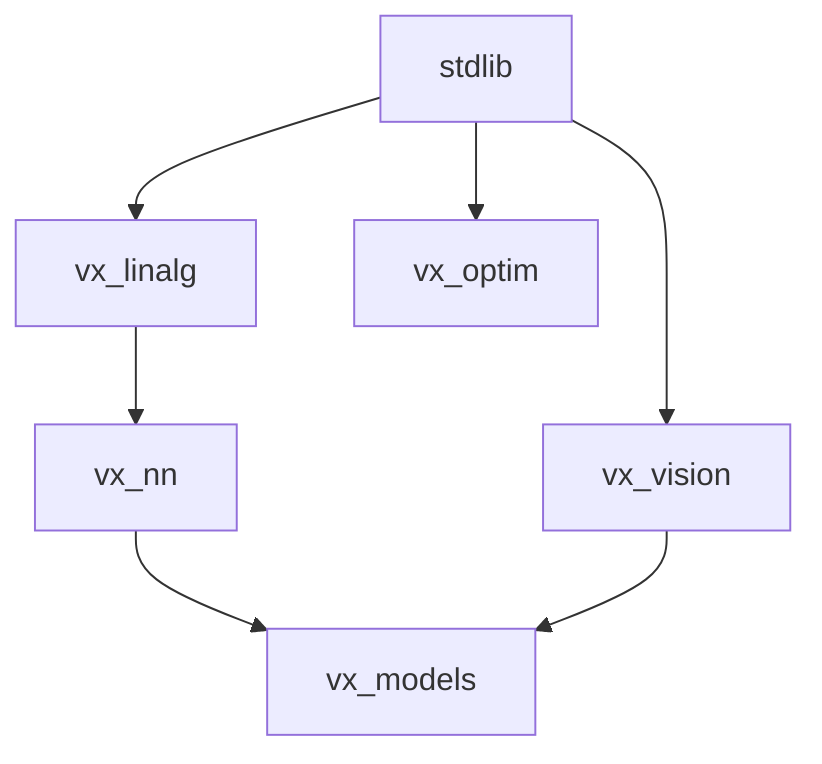

# Ecosystem Implementation Plan: Bottom-Up Strategy

To adhere to the acyclic dependency guidelines and ensure a smooth development process, we will build the ecosystem **bottom-up**. This means starting with the most independent leaf-node libraries and progressively building up to higher-level abstractions.

## Dependency Hierarchy

1. **Leaf Nodes (Tier 1)**: `vx_linalg`, `vx_optim`, `vx_vision`. These rely entirely on `stdlib/` (Tensors, Math).
1. **Intermediate Nodes (Tier 2)**: `vx_nn`. Relies heavily on `vx_linalg` (e.g., a `Linear` layer is fundamentally a BLAS `gemm` operation).
1. **Root Nodes (Tier 3)**: `vx_models`. Relies on `vx_nn` for network construction and `vx_vision` for data preprocessing.

## Phase 1: `vx_linalg` (The Foundation)

Since almost all ML workloads require dense linear algebra, this is the most critical leaf node.

**Planned Features for `vx_linalg`:**

- `matmul`: High-performance matrix multiplication.
- `transpose`: Matrix transposition.
- `norm`: L1 and L2 normalization routines.
- Basic test suite inside `packages/vx_linalg/tests/` to verify correctness using `vxc --emit-mlir` or direct execution.

## Next Steps

Once `vx_linalg` is mature, we can branch out into `vx_nn` (using our new `matmul` for `Linear` layers) and `vx_optim`.

## User Review Required

> [!IMPORTANT]\
> Does this dependency graph and Phase 1 focus (`vx_linalg`) look correct to you? If you approve, I will begin implementing the core linear algebra routines in `vx_linalg/lib.vx` and their associated tests!
