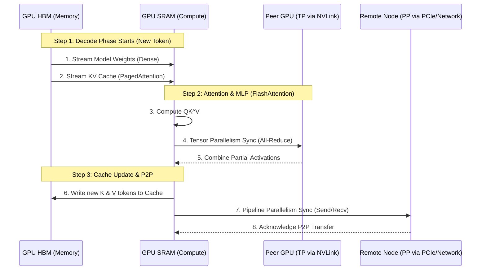
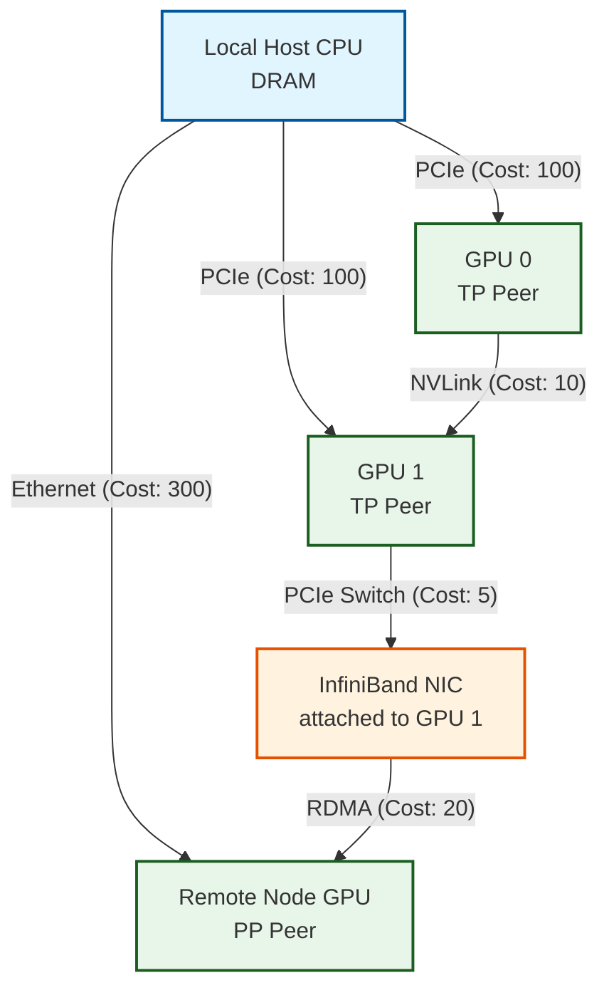
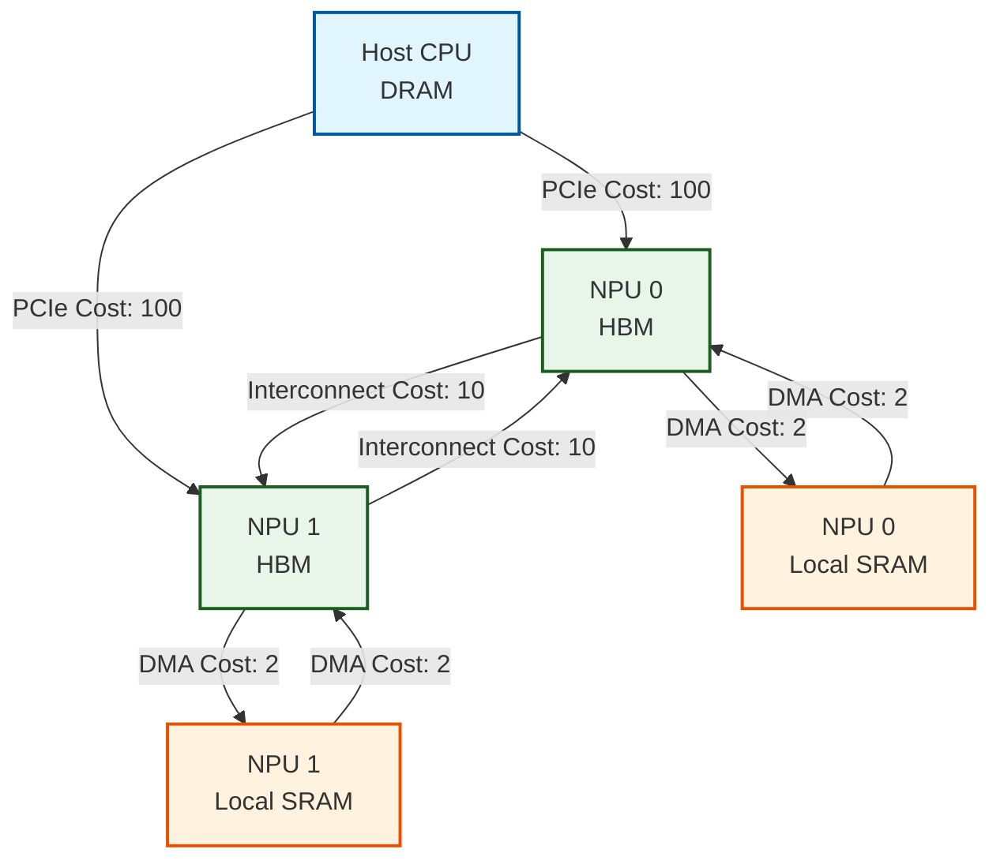
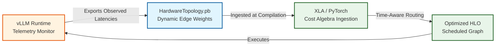

# Data Movement Cost Algebra: Heterogeneous Memory Routing for Graph Compilers

## Abstract

As machine learning hardware scales, compute nodes have evolved into complex, heterogeneous topologies comprising Host CPUs, NPUs, GPUs, and distinct memory hierarchies. Traditional compilers often abstract memory as a flat space or use simple boolean adjacency checks, masking the severe latency and bandwidth penalties of data movement. While modern frameworks like PyTorch and JAX rely heavily on operator fusion to mitigate transfers, they lack the intrinsic ability to actively resolve optimal multi-hop routing paths across distributed hardware.

In my ongoing implementation for PyTorch Inductor, I diagnose the limits of current Ahead-Of-Time (AOT) compilation and introduce a new heuristic framework: the "Data Movement Cost Algebra." By natively modeling hardware topologies as weighted directed graphs and applying Time-Aware Dijkstra algorithms, my implementation injects precise topological costs directly into PyTorch's intermediate representations (IR). Furthermore, I highlight a critical Profile-Guided Optimization (PGO) pipeline that bridges serving runtimes (like vLLM [5]) with my compiler modifications via dynamic, telemetry-driven feedback loops, ensuring Inductor's scheduling decisions are grounded in real-world hardware states.

______________________________________________________________________

## 1. Introduction: Diagnosing the Heterogeneity Problem

Modern Machine Learning accelerators are rarely isolated components. A single node often contains a Host CPU with standard DRAM, multiple interconnected GPUs with high-bandwidth memory (HBM), and tight local SRAM caches. Moving a large tensor between these domains incurs varying penalties.

For instance, transferring data from Host DRAM to GPU HBM across a PCIe bus is orders of magnitude slower than a direct DMA transfer between two GPUs over NVLink or NVSwitch.

### 1.1 The LLM Inference Bottleneck (LLaMA / Qwen)

To understand why flat memory abstractions fail, we must look at the real-world data movement demands of multi-stage Large Language Model (LLM) inference pipelines (e.g., LLaMA, Qwen). LLM generation is split into two phases:

1. **Prefill Phase (Compute-Bound):** The initial prompt is processed in parallel. Data movement is moderate compared to the heavy arithmetic intensity.
1. **Decode Phase (Memory-Bound):** Tokens are generated autoregressively one by one. This phase is heavily bottlenecked by memory bandwidth because the entire model weights and the ever-growing **KV Cache** must be streamed from HBM into the compute cores (SRAM) for every single token.

#### The Agony of 3D Parallelism Configs

In a scaled environment utilizing **3D Parallelism** (Tensor, Pipeline, and Data Parallelism), data movement during a single decode step involves agonizingly complex routing. Production engineering teams spend countless weeks manually configuring distributed topologies—tuning pipeline bubbles, desperately balancing mismatched PCIe, NVLink, and RDMA bandwidths, and writing custom NCCL groups to bypass asymmetric bottlenecks. The reality of deploying massive models across these jagged, heterogeneous clusters exposes the critical weakness of modern compilers: they treat inter-device memory homogeneously, leaving engineers to manually hardcode data paths.



When a massive model scales its context window, the KV cache footprint quickly outgrows the capacity of a single GPU's HBM. The system might be forced to offload the KV cache to a remote Host CPU (via PCIe) or stream it across nodes (via InfiniBand / RDMA).

#### The Naive Routing Pitfall in 3D Parallelism

To illustrate the limitations of current frameworks like PyTorch and JAX, consider the real-world asymmetric topology commonly found in 3D Parallelism clusters, where a direct InfiniBand connection from every GPU to every remote node does not exist.



If `GPU 0` must send a Pipeline Parallelism microbatch (Send/Recv) to the `Remote Node GPU`, an optimal network router would execute a multi-hop transfer: `GPU 0 -> GPU 1 (via NVLink) -> IB NIC -> Remote Node GPU` (Total Cost: **35**).

However, because PyTorch (`torch.compile`) and JAX (XLA) traditionally abstract memory spaces locally and lack a multi-hop graph solver in their graph compilers:

- **PyTorch Fallback:** PyTorch's distributed backend relies on explicit device mapping and NCCL. If a direct P2P RDMA mapping fails from `GPU 0` (since it lacks a local NIC), the framework typically falls back to a staging transfer through the Host: `GPU 0 -> CPU DRAM -> Ethernet -> Remote Node GPU` (Total Cost: **400**).
- **JAX / XLA Inefficiency:** XLA's HLO fusions excel at keeping data in local SRAM but treat inter-device memory homogeneously. It does not evaluate Dijkstra-style topological costs to dynamically relay the HLO communication through a peer GPU's NVLink to reach an asymmetric NIC.

Without an algebraic representation of these costs, compilers naively route data through slower interconnects, making scheduling decisions that stall the compute units while waiting for memory.

______________________________________________________________________

## 2. Formalizing the System Topology

To solve this, we must shift away from boolean connectivity checks (e.g., "Can node A reach node B?"). Instead, we formalize the hardware as a **Weighted Directed Graph**.



In the diagram above, routing data from `NPU 0` to `NPU 1` directly costs `10`, whereas routing it naively through the Host would cost `200` (`100 + 100`).

______________________________________________________________________

## 3. Traditional Approaches & Limitations

### 3.1. PyTorch (`torch.compile`, Inductor, & DTensor)

PyTorch’s primary compilation mechanism, `torch.compile` (backed by the Inductor compiler), addresses data movement primarily through **Kernel Fusion** and **Memory Planning** (see `torch/_inductor/scheduler.py` [1]). For distributed settings, PyTorch relies on the `DeviceMesh` and `DTensor` (Distributed Tensor) abstractions to propagate sharding layouts.

- **How it works:** Inductor performs vertical and horizontal fusion to keep intermediate activations in fast SRAM. Concurrently, when operations cross distributed boundaries, `DTensor` handles layout transformations, automatically inserting collective communication calls (via `DTensor.redistribute()` [2]) when the required output layout differs from the physical `DeviceMesh` layout.
- **The Limitation:** While `DeviceMesh` cleanly abstracts multi-dimensional communicators, PyTorch Inductor still models the *cost* of those memory transfers heuristically. When `DTensor.redistribute()` triggers an `all_reduce` or `all_gather`, the underlying compiler does *not* natively evaluate multi-hop heterogeneous hardware topologies to discover the lowest-latency path. If a multi-hop transfer across an asymmetric cluster is required, Inductor cannot automatically bypass saturated links because it lacks a built-in topological graph router.

### 3.2. JAX & XLA

JAX relies on the XLA (Accelerated Linear Algebra) compiler. XLA transforms computation graphs into High-Level Operations (HLO).

- **How it works:** Similar to PyTorch, XLA’s primary weapon against data movement costs is aggressive operator fusion. XLA attempts to keep data in local tile memory as long as possible.
- **The Limitation:** XLA still largely treats the target backend's global memory as a "flat" address space from the compiler's perspective once data is offloaded [3]. While XLA can partition graphs across TPUs (via `pjit`), the graph compiler does not calculate Dijkstra-style pathing costs to weigh the penalty of memory transfers. The network topology is abstracted away to the distributed runtime rather than exposed as an algebraic cost matrix in the IR.

______________________________________________________________________

## 4. My Implementation: Data Movement Cost Algebra in PyTorch

By moving topological awareness directly into Inductor's scheduling pass, my implementation enables true global optimizations.

### 4.1. The `TransferCostGraph` and Dijkstra Routing

Within my modifications to the architecture definition, a `TransferCostGraph` is instantiated to maintain the weighted directed graph of the `DeviceMesh`. When a data transfer is required (such as a `redistribute` event), my solver utilizes **Dijkstra's Algorithm** [6] to discover the shortest path.
If an application requests data to move from `Host_DRAM` to `GPU_1_Local_SRAM`, the graph solver automatically discovers the optimal route: `Host_DRAM -> GPU_1_HBM -> GPU_1_Local_SRAM`.

### 4.2. Injecting Cost into the IR

This topological routing happens during Inductor's semantic lowering phase. When my modified scheduler evaluates a data transfer operation, it queries the `TransferCostGraph`, retrieves the accumulated weight, and injects it directly into the Intermediate Representation (IR) node:

```rust
pub struct TransferExpr {
    pub source: Box<Expr>,
    pub target_space: MemorySpace,
    pub cost: Option<u32>, // The evaluated Dijkstra cost
}
```

### 4.3. Architectural Benefit

Because this cost is calculated during graph compilation, all downstream middle-end and backend optimization passes—such as loop unrolling, vectorization, and MLIR lowering—now have access to concrete hardware metrics. A scheduler can definitively weigh whether it is cheaper to compute a value locally or transfer it from a remote node, avoiding the pitfalls of naive flat-memory abstractions.

______________________________________________________________________

## 5. Beyond Dijkstra: Limitations and Advanced Strategies

While Dijkstra’s shortest path algorithm serves as a robust baseline for latency-critical point-to-point transfers, modern LLM workloads expose two fundamental limitations of simple shortest-path routing:

### 5.1 Capacity Constraints and Multi-Commodity Flow

Dijkstra calculates the optimal path for a *single* flow, ignoring link bandwidth limits (congestion). In dense scenarios like Mixture-of-Experts (MoE) token routing or All-to-All synchronizations across 3D parallel clusters, routing all traffic through the single "cheapest" path will quickly saturate that link while leaving redundant paths idle. Under these capacity constraints, data movement ceases to be a Shortest-Path problem and becomes a **Multi-Commodity Flow (MCF)** or Max-Flow Min-Cut problem. Compilers must support load-balancing strategies (e.g., Equal-Cost Multi-Path or ECMP routing) to distribute traffic across the network fabric dynamically.

### 5.2 Cyclic Topologies and Ring-Attention

Certain advanced attention mechanisms explicitly rely on moving the KV cache in a cyclic pattern across GPUs to process infinite context windows—most notably, **Ring-Attention**. A strict Dijkstra solver would attempt to "optimize" this data flow by finding the shortest linear path between any two nodes, potentially breaking the ring topology and violating the algorithm's throughput guarantees.

### 5.3 Time-Aware Dijkstra for Static Compilers (XLA)

For static compilers like XLA, the entire computational graph is fully known ahead of time. In this scenario, evaluating theoretical capacity is not enough; the compiler must maintain a global state of **time-based available bandwidth**. If multiple data transfers overlap in time over the same network wire, the effective capacity of that link is heavily reduced. A standard Dijkstra implementation ignores this temporal overlap.

To formalize this, we redefine the routing objective: instead of minimizing a scalar `cost`, the graph solver minimizes `arrival_time`. The edge weight becomes a dynamic function of the global time-state bandwidth matrix `B(e, t)` and the transfer payload size `P`.

#### Algorithm: Time-Aware Dijkstra

```python
Algorithm: Time-Aware Dijkstra for Static Compilation
Input:
  Graph G = (V, E) representing hardware topology
  Source node S, Target node T
  Transfer Payload size P
  Global Bandwidth State B(e, t) -> available bandwidth on edge e at time t
Output:
  Optimal path and earliest arrival time

1. Initialize ArrivalTime[v] = INFINITY for all v in V
2. ArrivalTime[S] = current_cycle
3. PriorityQueue PQ = { (S, current_cycle) }

4. While PQ is not empty:
5.     u, t_current = PQ.pop_min()
6.
7.     if u == T:
8.         return t_current, ReconstructPath(Parent, T)
9.
10.    for each neighbor v of u via edge e:
11.        // Find the earliest contiguous window starting at t_start >= t_current
12.        // where B(e, t) is sufficient to pipe payload P.
13.        t_start, duration = FindEarliestTransferWindow(e, t_current, P, B)
14.        t_arrival = t_start + duration
15.
16.        if t_arrival < ArrivalTime[v]:
17.            ArrivalTime[v] = t_arrival
18.            Parent[v] = u
19.            PQ.push((v, t_arrival))

20. // Post-Routing Step:
21. // Upon selecting the optimal path, the static compiler must decrement
22. // the global bandwidth state B(e, t) along the chosen edges for the
23. // duration [t_start, t_arrival] to reserve the capacity for subsequent
24. // transfers.
```

The core of this algorithm lies in the `FindEarliestTransferWindow` function. If a network wire is fully saturated at `t_current` by an overlapping transfer, this function intelligently delays `t_start` until bandwidth frees up. By staggering the transfers temporally (pipelining), the static compiler ensures the data flow does not bottleneck the hardware. Furthermore, the post-routing capacity reservation guarantees that all subsequent communication nodes in the AST respect the previously scheduled traffic.

### 5.4 An Extensible Cost Algebra

To address these limitations, my Data Movement Cost Algebra is designed as an *extensible framework*, not a hardcoded path. Depending on the `TransferCostGraph` profile or the specific kernel being lowered, my compiler modification can hot-swap its pathfinding strategy. For latency-critical weight streaming, Dijkstra is invoked. For throughput-critical pipeline syncs across thousands of nodes, an MCF solver can be employed.

Crucially, because AI hardware topologies typically consist of a relatively small number of vertices and edges (e.g., on the order of 10 interconnects within a single pod), my implementation is immune to the combinatorial explosion found in traditional wide-area network routing. It can afford to apply computationally expensive, mathematically exact optimization algorithms during compile-time to achieve maximal data movement efficiency without drastically inflating the compilation window.

### 5.5 Modifying the Inductor Backend

To move from theoretical algebra to practical execution, my implementation explicitly integrates this routing logic into the backend scheduling and memory allocation passes:

- **PyTorch (`torch.compile` / Inductor):** I have positioned this algebra as a logical next-generation evolution for `torch/_inductor/scheduler.py` [1]. During fusion scoring and memory planning, instead of relying on static heuristics, my modified Inductor scheduler queries the `TransferCostGraph`. Furthermore, this engine supersedes naive `DTensor.redistribute()` [2] collective calls, supplying mathematically proven, topology-aware multi-hop routes across the `DeviceMesh` for distributed operations.
- **JAX / XLA Equivalent:** If we were to port this logic to XLA, the Time-Aware Dijkstra algorithm is a perfect fit for its static ahead-of-time (AOT) pipeline. The integration targets `xla/hlo/utils/hlo_schedule.cc` and `xla/hlo/transforms/buffer_assignment.cc` [3]. When the `BufferAssignment` pass allocates intermediate memory, it queries the Dijkstra output to ensure tensors are scheduled onto memory banks that minimize multi-hop temporal overlap cost.
- **MLIR (LLVM) Equivalent:** Within the MLIR ecosystem, tensors are converted to explicit memory buffers via the `-one-shot-bufferize` pass (`mlir/lib/Dialect/Bufferization/Transforms/OneShotBufferize.cpp`) [4]. The Cost Algebra would act as an Analysis Pass running alongside bufferization. When determining whether to reuse a buffer or allocate a new one (inserting `memref.alloc`), the compiler evaluates if placing the `memref` in remote memory versus local SRAM provides a lower topological cost.

______________________________________________________________________

## 6. Dynamic Cost Estimation: PGO and Continuous Profiling

While topological modeling provides a strong baseline, theoretical peak bandwidths rarely reflect actual performance. Network edges suffer from dynamic real-time congestion, thermal throttling, and multi-tenant interference. To address this, the Data Movement Cost Algebra integrates **Profile-Guided Optimization (PGO)** and continuous hardware profiling.

### 6.1 Profile-Guided Weight Updates

In a purely Ahead-Of-Time (AOT) compiler paradigm, edge weights are static. By utilizing PGO, the compiler injects observed latencies from previous inference runs to update the `TransferCostGraph` with the *true* cost. This profile-guided weight update shifts the algebra from theoretical modeling to empirical optimization.

### 6.2 Continuous Hardware Profiling

Because LLM serving environments are highly dynamic, PGO is extended into real-time continuous profiling. Low-level hardware monitors (tracking NVLink saturation, PCIe queue depths, or RDMA buffer backpressure) feed live telemetry back into the system. This continuous feedback loop dynamically re-weights the graph edges, ensuring that the next stage of data transfer is routed using the absolute most current true cost.

### 6.3 O(1) Table Lookups (JIT vs AOT)

Re-evaluating computationally expensive pathfinding algorithms (like MCF) for every microbatch introduces unacceptable overhead. To solve this, the compiler employs a memoization strategy.
Once a true cost path is computed for a given source/destination pair, it is cached in a routing table. For subsequent transfers, if the continuous profiling monitors determine that the network state has not significantly drifted (the cost is not "stale"), the routing decision becomes an $O(1)$ table lookup.

This hybrid approach elegantly bridges the gap between AOT infrastructure (statically compiling baseline paths) and JIT infrastructure (dynamically re-routing only when continuous hardware profiles invalidate the $O(1)$ lookup table).

### 6.4 The vLLM PGO Pipeline: Protobufs to Compilers

Translating Profile-Guided Optimization from a theoretical concept to an engineering pipeline requires a standardized infrastructure handoff between the runtime engine and the compiler.



1. **The Runtime Telemetry (vLLM):** During active model serving, an infrastructure runtime like vLLM continuously monitors actual hardware data transfer times (e.g., PCIe queue depths, NVLink saturation, or RDMA backpressure).
1. **The Graph Manifest (Protobuf):** The runtime aggregates this telemetry and exports it into a structured format, typically a `HardwareTopology.pb` (Protobuf) or JSON manifest. This file acts as the source of truth for the *observed* time-based available bandwidths.
1. **Compiler Ingestion (XLA / PyTorch):** When a recompilation or dynamic dispatch is triggered, the underlying compiler (XLA or PyTorch Inductor) is configured to read the `HardwareTopology.pb` file from disk or via an IPC pipe.
1. **Executing the Cost Algebra:** The compiler parses the Protobuf to instantiate its internal `TransferCostGraph`. The Time-Aware Dijkstra algorithm is then executed, guaranteeing that the scheduling and buffer assignments perfectly align with the current, real-world state of the hardware.

______________________________________________________________________

## 7. Related Work

### 7.1. Network Routing & Multi-Commodity Flow in ML Fabrics

These papers validate the use of Time-Aware Dijkstra and Multi-Commodity Flow (MCF) solvers for heterogeneous memory topologies:

- **Efficient All-to-All Collective Communication Schedules for Direct-Connect Topologies** *(SIGCOMM / NSDI)*: Formulates bandwidth-optimal schedules using Time-Stepped Multi-Commodity Flow (tsMCF) on direct-connect ML accelerator topologies [8].
- **TACCL: Guiding Collective Algorithm Synthesis using Communication Sketches** *(Zhuge et al., NSDI 2023)*: Synthesizes optimal collective communication algorithms by strictly modeling the underlying hardware network topology, proving static NCCL fallbacks are suboptimal for asymmetric clusters [9].
- **Synthesizing Optimal Collective Algorithms** *(Bahar et al., PPoPP)*: Generates topology-aware routing for collective operations, bridging graph algorithms and hardware execution [10].

While prior state-of-the-art [8, 9, 10] applies Multi-Commodity Flow to generate static network schedules for isolated collective operations, my work uniquely bridges the gap between network routing mathematics and the compiler's Abstract Syntax Tree. This implementation is distinctly structurally unique across three axes:

**1. Micro-Architecture vs. Macro-Architecture:** Prior literature routing typically treats the compiler as a black box and stops at the Network Interface Card (NIC), routing data horizontally from Node A to Node B. Conversely, my algebra routes data *vertically* through a single node's heterogeneous memory hierarchy—from an NPU's SRAM, down to its HBM, across the PCIe bus, and into the Host CPU's DRAM. The internal micro-architecture of the compute node itself is treated as the routable network.
**2. Semantic IR Injection:** Unlike external scheduling libraries that wait for the compiler to request an `All-Reduce`, my implementation pushes the Time-Aware Dijkstra solver directly into the graph compiler's semantic phase (`src/sema/expr.rs` / PyTorch Inductor equivalent). The graph solver actively dictates whether the compiler should fuse operators, how to allocate memory buffers, and what MLIR dialects to lower into based on topological cost.
**3. Dynamic Telemetry vs. Static Optimization:** Existing literature relies on offline, static Multi-Commodity Flow formulations to generate fixed routing tables. My architecture employs a **Profile-Guided Optimization (PGO)** loop. By ingesting the `HardwareTopology.pb` manifest from a serving engine like vLLM, the compiler reacts to *live* congestion and bandwidth degradation.

In summary, while prior art applies MCF mathematics to static network schedules across clusters, my work is the first to inject it directly into the graph compiler's semantic phase to solve the single-node heterogeneous memory wall dynamically.

### 7.2. Topology-Aware Graph Compilation & 3D Parallelism

These papers address the limits of flat-memory abstractions in distributed deep learning:

- **Alpa: Automating Inter- and Intra-Operator Parallelism for Distributed Deep Learning** *(Zheng et al., OSDI 2022)*: Automates 3D parallelism strategies. The Data Movement Cost Algebra acts as the necessary layer for *routing* the data between these partitioned shards [11].
- **Unity: Accelerating DNN Training Through Joint Optimization of Algebraic Transformations and Parallelization** *(Ung et al., OSDI 2022)*: Explores the joint optimization of the computational graph and physical device mesh [12].
- **DeviceMesh and DTensor: Abstractions for Distributed Deep Learning** *(PyTorch)*: Introduces PyTorch's `DTensor.redistribute()` mechanism, the exact AOT compilation mechanism my Dijkstra router is augmenting [13].

### 7.3. Continuous Profiling & Compiler Heuristics (PGO)

These papers support the dynamic telemetry ingestion pipeline and the shift away from static heuristics:

- **Chameleon: Adaptive Code Optimization for Expedited Deep Neural Network Compilation** *(Ahn et al., ICLR)*: Utilizes profile-based feedback and reinforcement learning to optimize tensor layouts [14].
- **A Learned Performance Model for the Tensor Processing Unit** *(Kaufman et al., MLSys)*: Proves static analytical models of hardware fail to capture real-world congestion, validating the architecture of feeding `HardwareTopology.pb` telemetry back into the compiler [15].
- **Daydream: Accurately Estimating the Efficacy of Optimizations for DNN Training** *(Zhu et al., USENIX ATC)*: Maps low-level hardware profiling back to high-level deep learning graphs, paralleling the vLLM-to-compiler feedback loop [16].

### 7.4. LLM Inference Bottlenecks & Hardware-Software Co-Design

These papers ground the mathematical algebra in the severe realities of LLM deployment:

- **vLLM: Easy, Fast, and Cheap LLM Serving with PagedAttention** *(Kwon et al., SOSP 2023)*: Identifies the KV cache memory-bandwidth bottleneck during the decode phase [17].
- **ZipServ: Fast and Memory-Efficient LLM Inference with Hardware-Aware Lossless Compression** *(Yang et al., ASPLOS 2026)*: Analyzes how hardware-software mismatches at the kernel and system levels cause redundant memory traffic [18].

______________________________________________________________________

## 8. Conclusion

By adopting a Data Movement Cost Algebra, compilers transcend boolean hardware connectivity and make highly informed data-flow decisions. Treating the internal architecture of a compute node as a routable network minimizes latency and maximizes throughput. With the full implementation of Multi-Commodity Flow solvers and continuous profile-guided edge weighting directly integrated into the IR semantic phase, the compiler achieves optimal global traffic engineering for modern LLM inference.

______________________________________________________________________

## 9. References

1. **PyTorch Inductor Memory Planning:** [`torch/_inductor/scheduler.py`](https://github.com/pytorch/pytorch/blob/main/torch/_inductor/scheduler.py)
1. **PyTorch DTensor Redistribute:** [`torch/distributed/tensor/_redistribute.py`](https://github.com/pytorch/pytorch/blob/main/torch/distributed/tensor/_redistribute.py)
1. **XLA Buffer Assignment:** [`xla/hlo/transforms/buffer_assignment.cc`](https://github.com/openxla/xla/blob/main/xla/hlo/transforms/buffer_assignment.cc)
1. **MLIR OneShotBufferize:** [`mlir/lib/Dialect/Bufferization/Transforms/OneShotBufferize.cpp`](https://github.com/llvm/llvm-project/blob/main/mlir/lib/Dialect/Bufferization/Transforms/OneShotBufferize.cpp)
1. **vLLM Telemetry/Metrics:** [`vllm/engine/metrics.py`](https://github.com/vllm-project/vllm/blob/main/vllm/engine/metrics.py)
1. **Dijkstra's Algorithm:** Dijkstra, E. W. (1959). *A note on two problems in connexion with graphs*. Numerische Mathematik, 1, 269–271.
1. **Multi-Commodity Flow Networking:** Ford, L. R., & Fulkerson, D. R. (1958). *Constructing Maximal Dynamic Flows from Static Flows*. Operations Research.
1. **tsMCF:** Efficient All-to-All Collective Communication Schedules for Direct-Connect Topologies (SIGCOMM / NSDI).
1. **TACCL:** Zhuge et al. (2023). *Guiding Collective Algorithm Synthesis using Communication Sketches*. NSDI.
1. **Bahar et al.:** *Synthesizing Optimal Collective Algorithms*. PPoPP.
1. **Alpa:** Zheng et al. (2022). *Automating Inter- and Intra-Operator Parallelism for Distributed Deep Learning*. OSDI.
1. **Unity:** Ung et al. (2022). *Accelerating DNN Training Through Joint Optimization of Algebraic Transformations and Parallelization*. OSDI.
1. **DeviceMesh and DTensor:** Abstractions for Distributed Deep Learning (PyTorch Conference / MLSys).
1. **Chameleon:** Ahn et al. *Adaptive Code Optimization for Expedited Deep Neural Network Compilation*. ICLR.
1. **Learned Performance Model:** Kaufman et al. *A Learned Performance Model for the Tensor Processing Unit*. MLSys.
1. **Daydream:** Zhu et al. *Accurately Estimating the Efficacy of Optimizations for DNN Training*. USENIX ATC.
1. **vLLM:** Kwon et al. (2023). *Easy, Fast, and Cheap LLM Serving with PagedAttention*. SOSP.
1. **ZipServ:** Yang et al. (2026). *Fast and Memory-Efficient LLM Inference with Hardware-Aware Lossless Compression*. ASPLOS.
