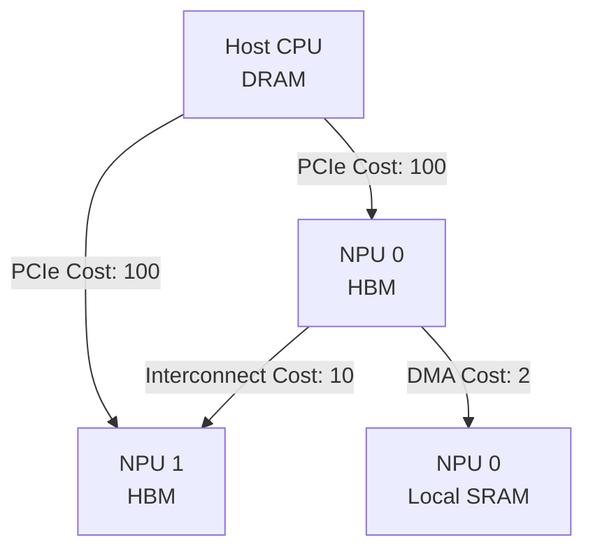

# Data Movement Cost Algebra in Heterogeneous Compilers

Here is a slide deck proposal for the PyTorch Conference based on the "Data Movement Cost Algebra" design and implementation. Since the deadline is today, this is structured as a complete, ready-to-present slide deck using markdown carousels.

````carousel
# Data Movement Cost Algebra in Heterogeneous Compilers
**Treating Hardware Topologies as Networks to Optimize Data-Flow**

*Presented at: PyTorch Conference*

---
**Core Thesis:** Data movement must be treated algebraically to enable global, topology-aware compiler optimizations in modern heterogeneous systems.
<!-- slide -->
## 1. The Heterogeneity Problem

Modern machine learning workloads run on increasingly complex hardware topologies.
Without topological routing, data movement costs stall computation.



> [!WARNING]
> **Data Movement is NOT Free.** Moving a large tensor from Host DRAM to NPU HBM incurs massive latency and bandwidth penalties compared to local memory transfers.
<!-- slide -->
## 2. The Traditional Compiler Fallacy

Historically, compilers treat all memory in one of two ways:
1.  **Flat Address Space:** Ignoring the physical distance between components.
2.  **Boolean Connectivity Check:** Simply asking, *"Can the NPU read this memory? Yes/No."*

**The Consequence:**
*   Moving data to an NPU for a trivial computation where transfer cost outweighs compute savings.
*   Routing data through an inefficient multi-hop path when a direct DMA connection exists.
*   Frameworks like `torch.compile` or JAX heavily rely on **Operator Fusion** to avoid transfers, but lack active multi-hop routing capabilities.
<!-- slide -->
## 3. Introducing: Data Movement Cost Algebra

We need a mathematical formalization of the topology to answer: **"What is the exact penalty of transferring data from A to B?"**

*   **Weighted Directed Graphs:** The `TransferCostGraph` is upgraded from an unweighted adjacency list to a weighted directed graph.
*   **Edge Weights:** Each edge between `MemorySpace` nodes carries a numerical weight representing relative latency and bandwidth costs.
*   **Network Routing in Compilers:** We apply network routing concepts (Dijkstra's Shortest Path) directly inside the compiler frontend.
<!-- slide -->
## 4. Pathfinding with Dijkstra

Instead of static checks, the Semantic Analyzer dynamically navigates the hardware topology:

1.  **Encounter a Transfer:** The compiler sees a request to move data from `Host_DRAM` to `NPU_HBM`.
2.  **Graph Query:** It queries the `TransferCostGraph`.
3.  **Dijkstra's Algorithm:** It calculates the optimal multi-hop route. If no direct connection exists, it finds the cheapest indirect path (e.g., `Host -> NPU 1 -> NPU 2`).
4.  **Accumulated Weight:** The total path weight becomes the "Data Movement Cost."
<!-- slide -->
## 5. Compiler Integration: The AST

This computed cost is fundamentally baked into the Abstract Syntax Tree (AST):

```rust
// AST Representation Example
pub struct TransferExpr {
    pub source: Box<Expr>,
    pub target_space: MemorySpace,
    pub cost: Option<u32>, // <--- Injected during Semantic Analysis
}
```

> [!IMPORTANT]
> **Frontend Calculation:** By calculating this in the semantic phase *before* MLIR lowering, all middle-end passes (loop unrolling, vectorization) have concrete topological costs to guide their heuristics.
<!-- slide -->
## 6. How PyTorch Handles Data Movement

PyTorch (`torch.compile` & Inductor) tackles data movement primarily through **Kernel Fusion** and **Memory Planning** (e.g., `torch/_inductor/scheduler.py`).

*   **Operator Fusion:** Chaining operations vertically into single Triton kernels to keep data in SRAM and avoid VRAM round-trips.
*   **Buffer Reuse:** Aggressively sharing memory blocks for non-overlapping tensors.
*   **Limitation:** Inductor does not natively model multi-hop heterogeneous hardware. Moving data across the Host or between NPUs requires manual `.to(device)` calls. It lacks a topological router to automatically find the lowest-latency DMA path across nodes.
<!-- slide -->
## 7. How JAX (XLA) Handles Data Movement

JAX delegates computation to the Accelerated Linear Algebra (XLA) compiler, which optimizes High-Level Operations (HLO).

*   **HLO Fusion:** XLA aggressively fuses operations to maintain intermediate tensors in fast, local tile memory.
*   **Limitation:** While JAX handles parallel distribution well (`pjit`), XLA treats global memory for a given accelerator as a flat address space. It does not calculate Dijkstra-style pathing costs for explicit multi-hop routing between memory domains within a single AST compilation step.
<!-- slide -->
## 7. Case Study & Future Work

### Complex Routing Scenario
**Goal:** Move data: `Host -> NPU -> Local SRAM`.
*   **Naive Approach:** Might route through a slower interconnect.
*   **Cost Algebra Approach:** Automatically discovers the lowest-latency DMA path available in the `TransferCostGraph`.

### Future Work
*   **Dynamic Edge Weighting:** Using ML models to dynamically update edge weights based on real-time interconnect congestion.
*   **Multi-Node Clusters:** Extending the Dijkstra routing to scale across distributed networking fabrics (e.g., InfiniBand).
````

### Submission Abstract (For the CFP)

If you need to submit an abstract today, here is a 200-word summary you can copy/paste:

> **Title:** Data Movement Cost Algebra: Heterogeneous Memory Routing for Graph Compilers
>
> **Abstract:** As machine learning hardware scales, compute nodes have evolved into complex, heterogeneous topologies comprising Host CPUs, multiple NPUs, and distinct memory hierarchies (DRAM, HBM, SRAM). Traditional compilers often abstract memory as a flat space or use boolean adjacency checks, masking the severe latency and bandwidth penalties of data movement. While frameworks like PyTorch and JAX rely heavily on operator fusion to mitigate transfers, they lack the ability to actively resolve optimal multi-hop routing paths.
>
> In this talk, we introduce "Data Movement Cost Algebra," a methodology that natively models hardware topologies as weighted directed graphs within the compiler frontend. By applying Dijkstra’s shortest path algorithm during semantic analysis, the compiler determines the precise cost of transferring tensors across memory spaces. This cost is directly injected into the Abstract Syntax Tree (AST). By shifting network-style pathfinding into the compiler's semantic phase, downstream optimizations (like MLIR lowering, loop unrolling, and scheduling) can leverage concrete, topology-aware heuristics. We will discuss the mathematical formalization, the AST integration, and demonstrate how applying routing algorithms at compile-time outperforms naive memory management in multi-accelerator environments.
